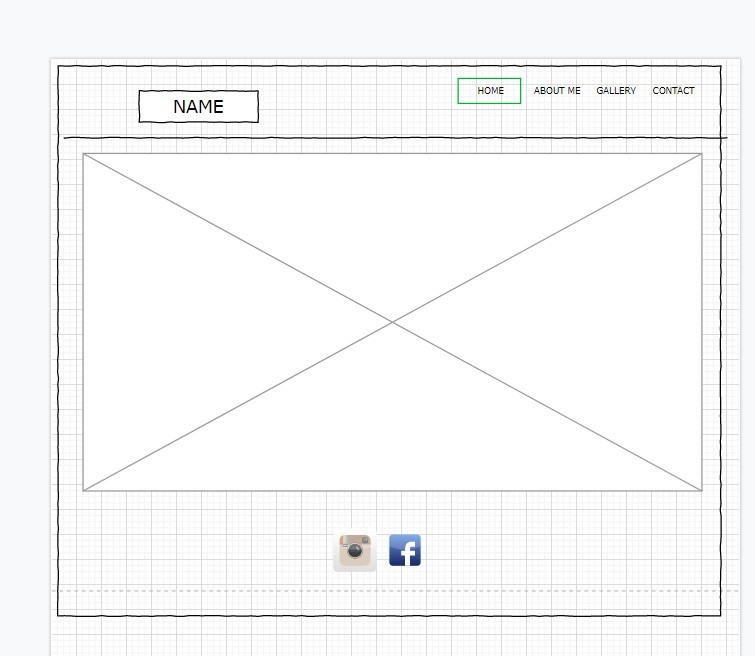

# Modeling Portfolio Website
This website is a milestone project, and a part of Full Stack Software Development program, which summarizes HTML/CSS module provided by Code Institute, an educational platform used by Canadian Business College. 
The website was developed as a model’s online portfolio. The main purpose of it is to increase model's online presence and attract interest of potential clients searching to book a model for a project.

## UX
Creating a wireframe for a home page I wanted it to be simple and easy to understand. My original plan was to create header with model's name and navigation bar, footer with social links and a big hero image. But also I didn’t want it to be boring, so I’ve decided to put a short video as a background instead of hero image.

The most complex part of this website is "About Me" page as it consists of three elements and I had to make sure it was responsive and looks good on all types of devices. This is where Bootstrap’s grid system was very helpful. I’ve divided my content into three columns and made them appear in one row on desktop devices, two rows on tablets, and one element at a time on mobile devices.

## Features
-	Navigation bar that becomes collapsible on devices with smaller screen.
-	“Carousel” gallery that switches pictures automatically and also has manual controls.
-	Footer with ikons linked to social media pages.
-	Video background repeated on all pages.

## Features Left to Implement
-	Contact form is not linked to anything at the moment, so messages won’t be sent. 
-	Decreasing resolution of video and images may help webpage to load faster. 

## Technologies Used
-	HTML
-	CSS
-	Bootstrap
-	GitHub
-	GitPod
-	Font Awesome
-	Google Fonts
-	Draw.io
## Testing
Most of the testing was made manually using Google Chrome Inspect tool. To make sure the site is responsive and working properly I’ve done all possible actions on all types of available devices. Navigation bar, social links, carousel, contact form are working as they are expected. 
Special thanks to http://ami.responsivedesign.is/ where I checked responsiveness on different types of devices.

